# Vertex AI Fraud Detection Pipeline

This project demonstrates a complete machine learning pipeline for fraud detection using Google Cloud Vertex AI. It includes data processing, model training (Decision Tree, Random Forest, XGBoost), hyperparameter tuning, and deployment.

---

# Vertex AI

Vertex AI is a unified, open platform for building, deploying, and scaling generative AI and machine learning (ML) models and AI applications. It provides access to the Model Garden, featuring a curated catalog of over 200 models—including Google's foundation models (such as Gemini) and a comprehensive selection of partner and open models—along with the underlying TPU/GPU infrastructure. Vertex AI supports cutting-edge GenAI workflows as well as AI inference workflows for MLOps. It offers end-to-end MLOps tools and enterprise-grade controls for governance, security, and compliance.

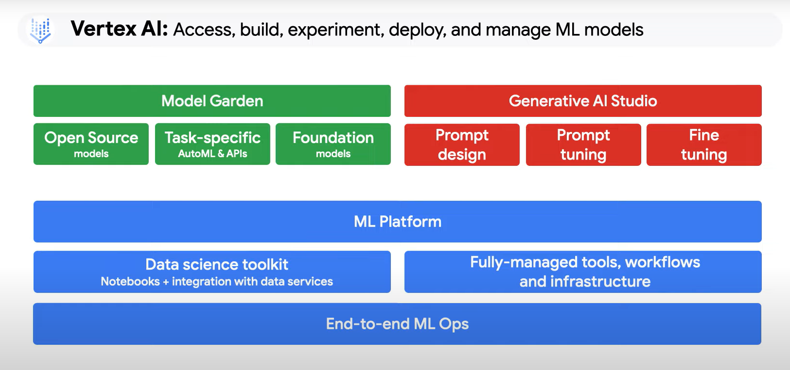

# Vertex AI provides tools and services that map to each stage of the ML workflow:

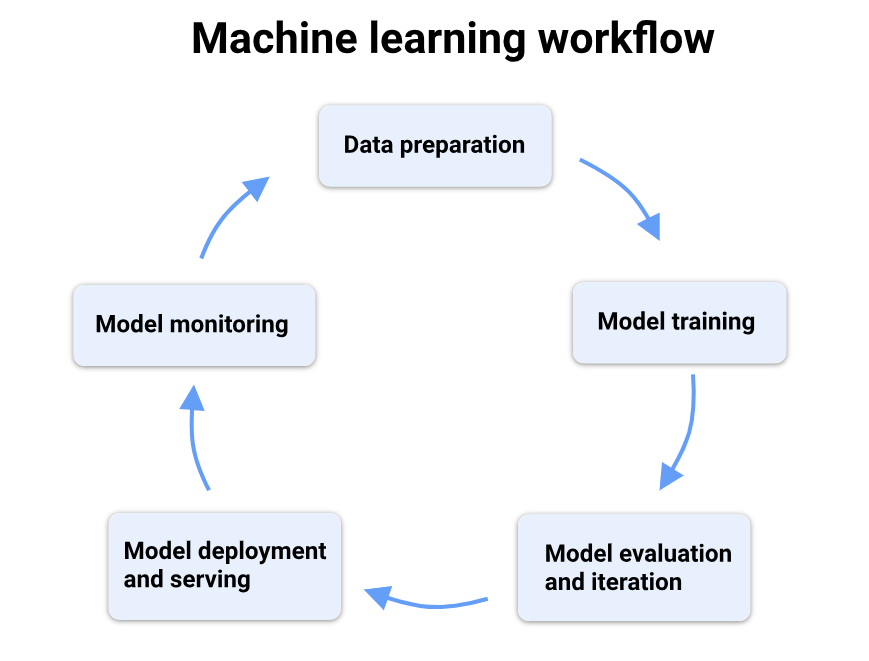

## 1.Data preparation: 

Collect, clean, and transform your data.

Use Vertex AI Workbench notebooks to perform exploratory data analysis (EDA).
Integrate with Cloud Storage and BigQuery for data access.
Use Dataproc Serverless Spark for large-scale data processing.


## 2. Model training: 

Train your ML model.

Choose between AutoML for code-free training or Custom training for full control.

Manage and compare training runs using Vertex AI Experiments.

Register trained models in the Vertex AI Model Registry.

Vertex AI Training offers both serverless training and training clusters.

Use Vertex AI serverless training to run your custom training code on-demand in a fully managed environment. See the [Vertex AI serverless training overview][serverless].

Use Vertex AI training clusters for large jobs that need assured capacity on dedicated, reserved accelerator clusters. See Vertex AI training clusters overview.

Use Ray on Vertex AI to scale Python and ML workloads with the open-source Ray framework on a managed, interactive cluster. See Ray on Vertex AI overview.

Use Vertex AI Vizier to adjust model hyperparameters in complex ML models.

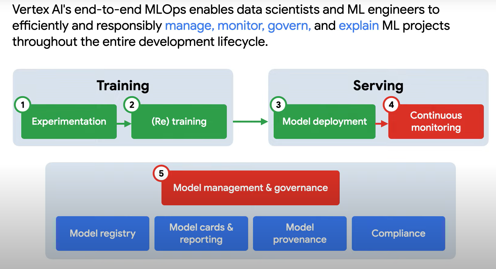

## 3. Model evaluation and iteration: 

Assess and improve model performance.

Use model evaluation metrics to compare models.

Integrate evaluations within Vertex AI Pipelines workflows.

## 4. Model serving: Deploy and get inferences from your model.

Deploy for online inferences with prebuilt or custom containers.

Perform batch inferences for large datasets.

Use Optimized TensorFlow runtime for efficient TensorFlow serving.

Understand model inferences with Vertex Explainable AI.

Serve features from Vertex AI Feature Store.

Deploy models trained with BigQuery ML.

## 5. Model monitoring: 

Track deployed model performance over time.

Use Vertex AI Model Monitoring to detect training-serving skew and inference drift.

## MLOps Tools:

Automate, manage, and monitor your ML projects:

Vertex AI Pipelines: Orchestrate and automate ML workflows as reusable pipelines.

Vertex AI Model Registry: Manage the lifecycle of your ML models, including versioning and deployment.

Vertex AI serverless training: Run your custom training code on-demand in a fully managed environment

Vertex AI Model Monitoring: Monitor deployed models for data skew and drift to maintain performance.

Vertex AI Experiments: Track and analyze different model architectures and hyperparameters.

Vertex AI Feature Store: Manage and serve feature data for training models or making real-time predictions.

Vertex ML Metadata: Track and manage metadata for ML artifacts.

Vertex AI training clusters: Train large-scale jobs that require assured capacity on a dedicated, reserved cluster of accelerators.

Ray on Vertex AI: Scale Python and ML workloads using the open-source Ray framework on a managed, interactive cluster.


# Vertex AI Inference:

An inference is the output of a trained machine learning model.

Vertex AI offers two methods for getting inferences:

**Online inferences** are synchronous requests made to a model that is deployed to an Endpoint. Therefore, before sending a request, you must first deploy the Model resource to an endpoint. This associates compute resources with the model so that the model can serve online inferences with low latency. Use online inferences when you are making requests in response to application input or in situations that require timely inference.

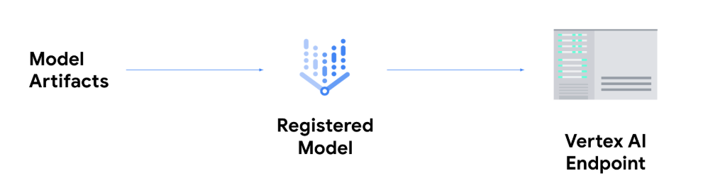

Once the model is deployed to an endpoint it accepts requests like any other REST endpoint, which means you can call it from a Cloud Run function, chatbot, a web app, etc. Note that you can deploy multiple models to a single endpoint, splitting traffic between them. This functionality is useful, for example, if you want to roll out a new model version but don't want to direct all traffic to the new model immediately. You can also deploy the same model to multiple endoints.

**Batch inferences** are asynchronous requests made to a model that isn't deployed to an endpoint. You send the request (as a BatchPredictionJob resource) directly to the Model resource. Use batch inferences when you don't require an immediate response and want to process accumulated data by using a single request.

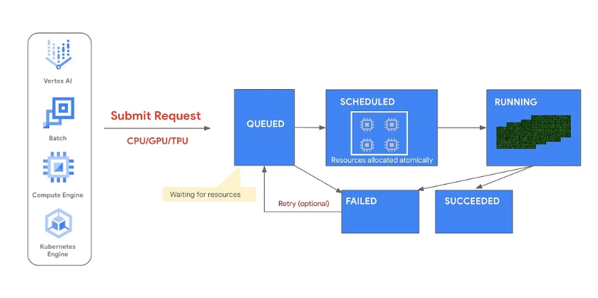


# Vertex AI Training:

Vertex AI offers a spectrum of training methods designed to meet your needs, from fully automated to fully custom.


**AutoML:** Build high-quality models with minimal technical effort by leveraging Google's automated ML capabilities.

**Vertex AI serverless training:** Run your custom training code in a fully managed, on-demand environment without worrying about infrastructure.

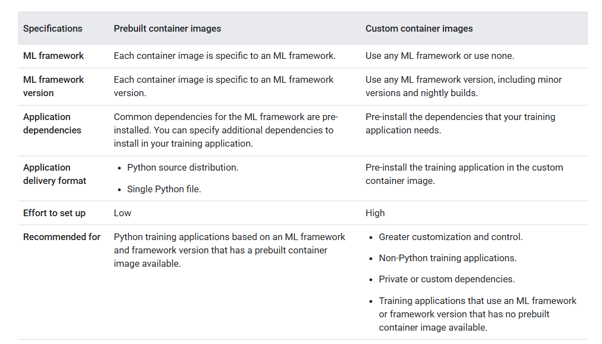

**Vertex AI training clusters:** Run large-scale, high-performance training jobs on a dedicated cluster of accelerators reserved for your exclusive use.

**Ray on Vertex AI:** Scale Python applications and ML workloads using the open-source Ray framework on a managed service.

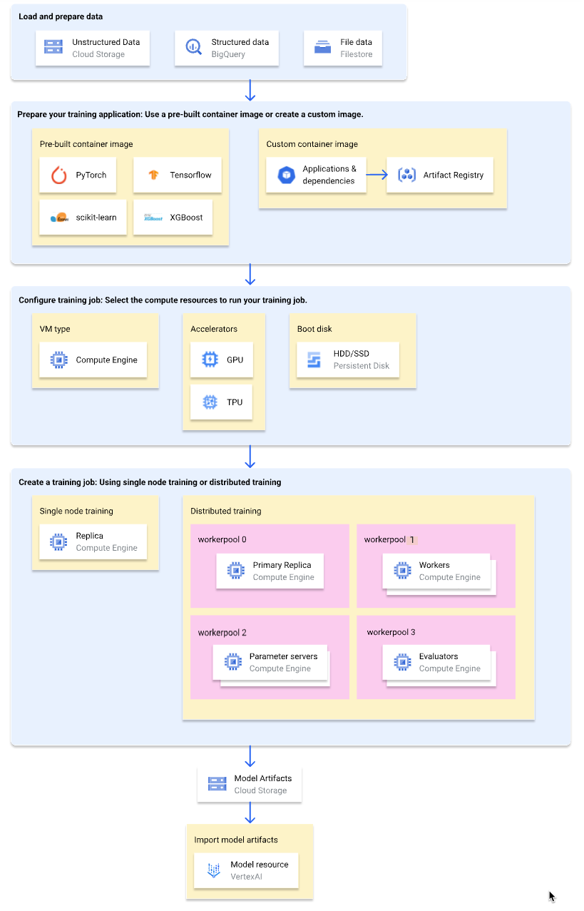


# Vertex AI offers three types of training jobs for running your training application:

## Custom job:

A custom job (CustomJob) runs your training application. If you're using a prebuilt container image, model artifacts are output to the specified Cloud Storage bucket. For custom container images, your training application can also output model artifacts to other locations.

## Hyperparameter tuning job:

A hyperparameter tuning job (HyperparameterTuningJob) runs multiple trials of your training application using different hyperparameter values until it produces model artifacts with the optimal performing hyperparameter values. You specify the range of hyperparameter values to test and the metrics to optimize for.

## Training pipeline:

A training pipeline (CustomTrainingJob) runs a custom job or hyperparameter tuning job and optionally exports the model artifacts to Vertex AI to create a model resource. You can specify a Vertex AI managed dataset as your data source.

---

# Project Implementation Details

## Project Structure

```
vertex_ai_pg/
├── README.md               # Project documentation
├── requirements.txt        # Python dependencies
├── EDA.ipynb               # Exploratory Data Analysis notebook
├── src/
│   ├── dataprocessing.py   # Data preprocessing script
│   └── models/             # Training scripts
│       ├── decision_tree.py
│       ├── dt_smote.py
│       ├── dt_tuned.py
│       ├── random_forest.py
│       ├── rf_smote.py
│       ├── rf_tuned.py
│       └── xg_boost.py
└── images/                 # Documentation images
```

## Setup

1.  **Clone the repository:**
    ```bash
    git clone <repository-url>
    cd vertex_ai_pg
    ```

2.  **Install dependencies:**
    ```bash
    pip install -r requirements.txt
    ```

3.  **Configure Google Cloud SDK:**
    Ensure you have the Google Cloud SDK installed and authenticated.
    ```bash
    gcloud auth login
    gcloud config set project <YOUR_PROJECT_ID>
    ```

# Data Storage:
## Raw Data:
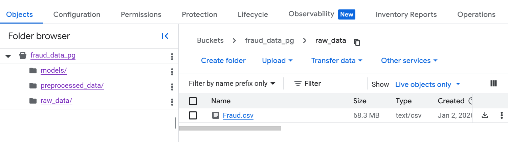

## Processed Data:
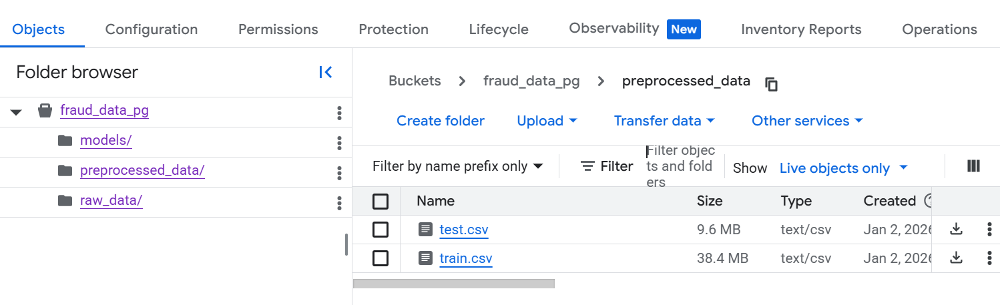

## Model Artifacts:
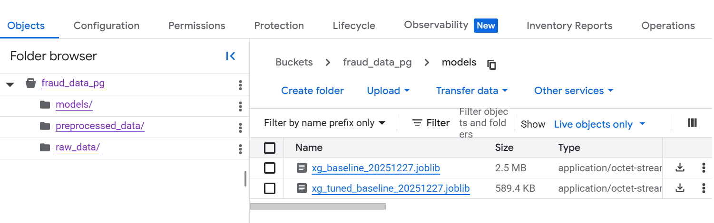

## Usage

### 1. Data Processing
Preprocess your raw data using the `dataprocessing.py` script. This script handles data cleaning and transformation.

```bash
python src/dataprocessing.py
```

### 2. Model Training
The `src/models/` directory contains scripts for training various models. You can run them locally or submit them as Vertex AI Custom Jobs.

**Example: Training a Random Forest Model**
```bash
python src/models/random_forest.py
```

**Available Training Scripts:**
*   `decision_tree.py`: Basic Decision Tree.
*   `dt_smote.py`: Decision Tree with SMOTE for class imbalance.
*   `dt_tuned.py`: Hyperparameter tuned Decision Tree.
*   `random_forest.py`: Basic Random Forest.
*   `rf_smote.py`: Random Forest with SMOTE.
*   `rf_tuned.py`: Hyperparameter tuned Random Forest.
*   `xg_boost.py`: XGBoost model.

---

---

# Overfitting and Underfitting

In machine learning, **overfitting** occurs when a model learns the training data too well, capturing noise and outliers rather than the underlying pattern. This results in high accuracy on training data but poor performance on unseen test data. **Underfitting** happens when a model is too simple to capture the underlying structure of the data, leading to poor performance on both training and test data.

In this project, we employed several techniques to address these challenges and ensure robust model performance:

### Techniques to Address Overfitting:
*   **Hyperparameter Tuning:** We used `GridSearchCV` to find the optimal set of hyperparameters for our models.
    *   **Max Depth:** Constrained the maximum depth of trees (`max_depth`) to prevent them from growing too complex and memorizing the training data.
    *   **Min Samples Split/Leaf:** Tuned `min_samples_split` and `min_samples_leaf` to ensure that nodes have enough data points to make statistically significant splits.
*   **Cross-Validation:** We implemented `StratifiedKFold` cross-validation (5 folds) to assess model performance on different subsets of the data. This helps ensure that the model's performance is consistent and not dependent on a specific train-test split.
*   **Ensemble Methods:**
    *   **Random Forest:** By averaging the predictions of multiple decision trees trained on different subsets of data and features, Random Forest reduces the variance associated with individual trees, making it less prone to overfitting.
    *   **XGBoost:** This gradient boosting algorithm builds trees sequentially, where each new tree corrects the errors of the previous ones. Regularization parameters (like learning rate and tree depth constraints) help control overfitting.

### Techniques to Address Underfitting & Class Imbalance:
*   **Class Weighting:** Since fraud detection datasets are highly imbalanced (few fraud cases compared to non-fraud), models can be biased towards the majority class (underfitting the minority class). We used `class_weight='balanced'` in Decision Trees and Random Forests, and `scale_pos_weight` in XGBoost to give more importance to the minority class during training.
*   **SMOTE (Synthetic Minority Over-sampling Technique):** We applied SMOTE to generate synthetic examples of the minority class (fraud) in the training data. This helps the model learn the decision boundary for fraud cases more effectively, preventing it from simply predicting "non-fraud" for everything.
*   **Threshold Tuning:** Instead of using the default classification threshold of 0.5, we tuned the threshold to optimize for **Recall** and **Precision**. This allows us to adjust the model's sensitivity to fraud, ensuring we catch more fraud cases even if it means accepting a slightly higher false positive rate (which is often acceptable in fraud detection).

---

# Imbalanced Dataset Handling

In fraud detection, the dataset is typically **highly imbalanced**, meaning there are significantly fewer fraudulent transactions (positive class) compared to legitimate ones (negative class). This poses a challenge because standard machine learning models often bias towards the majority class to maximize overall accuracy, potentially missing the rare but critical fraud cases.

### Metrics for Imbalanced Data:
When dealing with imbalanced datasets, relying solely on **Accuracy** can be misleading (e.g., a model predicting "no fraud" for every case could still have 99% accuracy). Instead, we focus on the following metrics:

*   **ROC-AUC (Receiver Operating Characteristic - Area Under Curve):** Measures the model's ability to distinguish between classes across all classification thresholds. A score of 0.5 represents random guessing, while 1.0 represents a perfect model.
*   **Precision-Recall AUC (PR-AUC):** Often more informative than ROC-AUC for highly imbalanced datasets. It focuses on the performance of the minority class (fraud).
*   **F1-Score:** The harmonic mean of Precision and Recall. It provides a single score that balances both concerns:
    *   **Precision:** Of all transactions predicted as fraud, how many were actually fraud? (Minimizing false alarms).
    *   **Recall (Sensitivity):** Of all actual fraud transactions, how many did the model correctly identify? (Minimizing missed fraud).
*   **Confusion Matrix:** A tabular visualization that breaks down predictions into True Positives (caught fraud), False Positives (false alarm), True Negatives (correctly identified legitimate), and False Negatives (missed fraud). This helps in understanding the specific types of errors the model is making.

---

# Fraud Detection Model:

# Decision Tree Model:

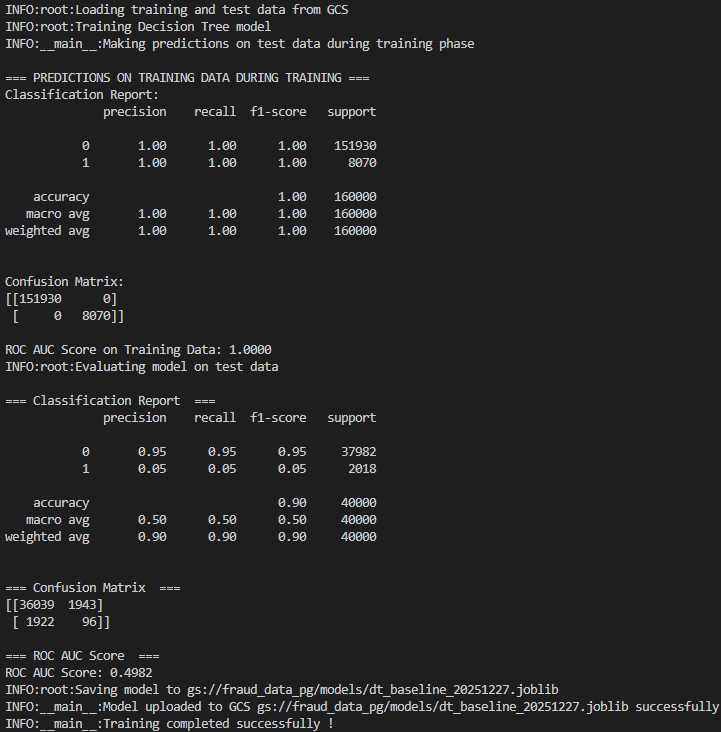

# Fine tuned Decision Tree Model:

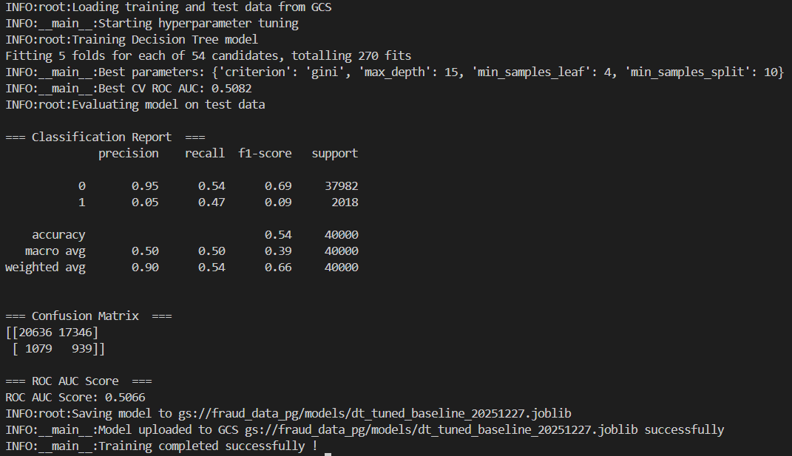

# SMOTE Decision Tree Model:
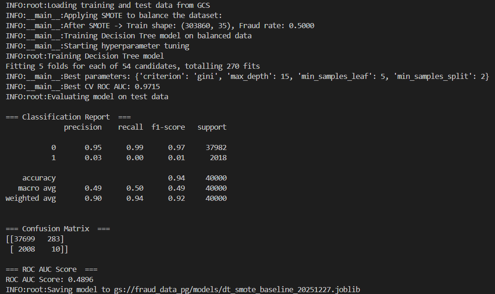


# Random Forest Model:

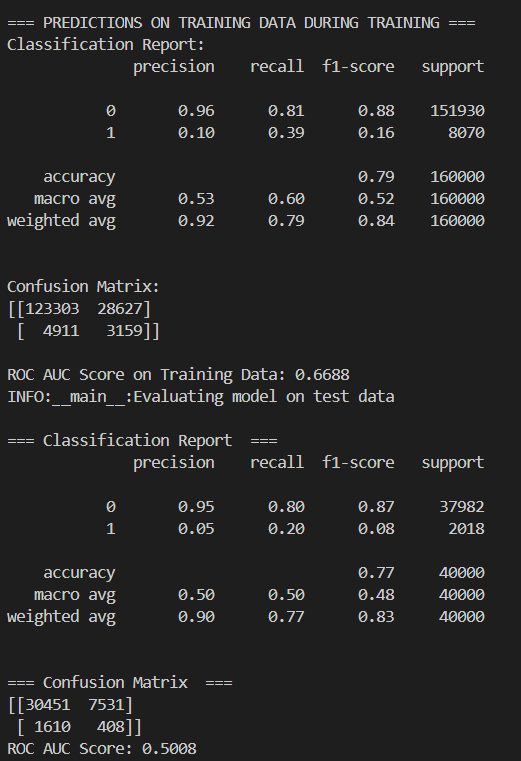

# SMOTE Random Forest Model:

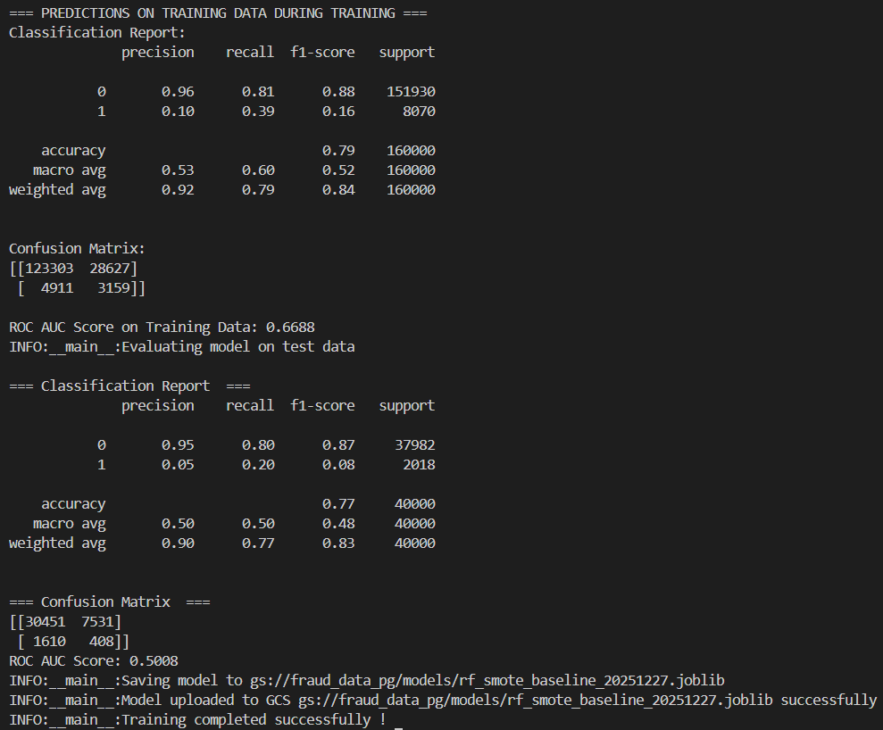

# Fine tuned Random Forest Model:

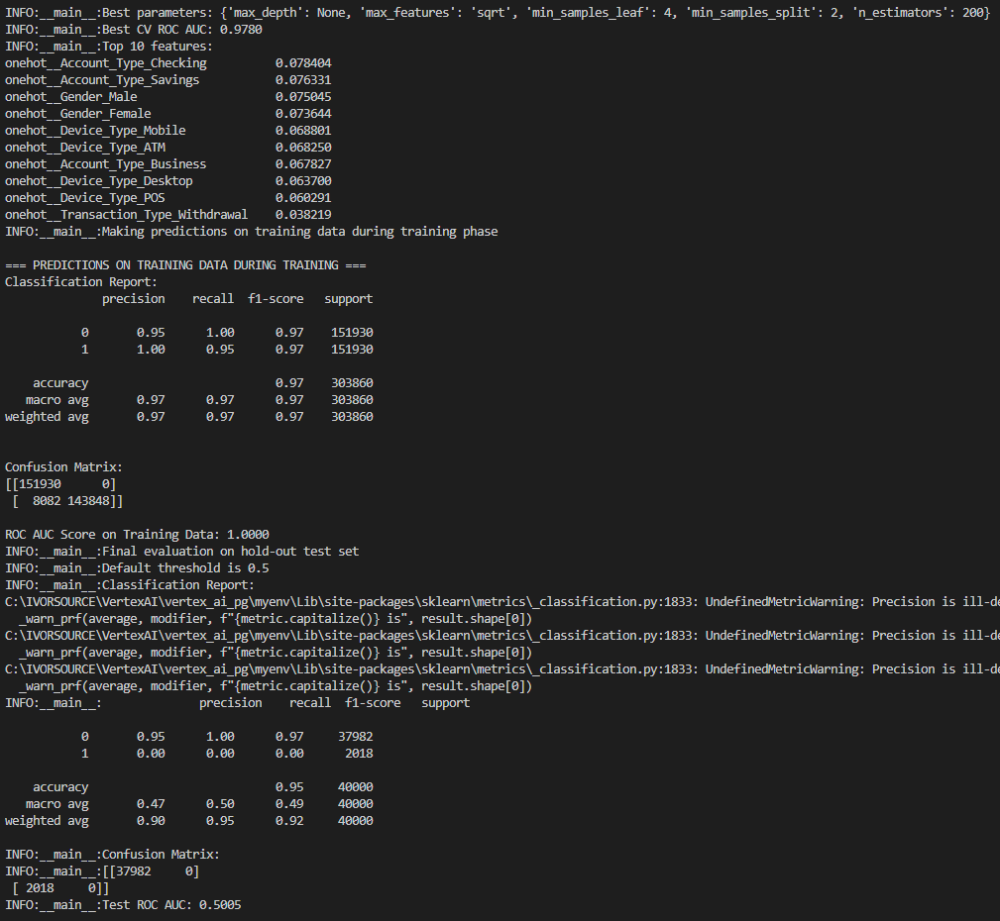

# XGBoost Model:
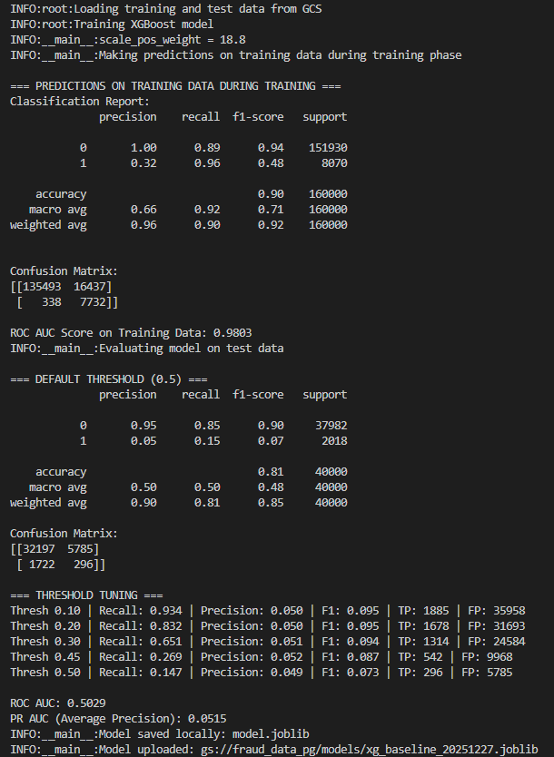

# Fine tuned XGBoost Model:
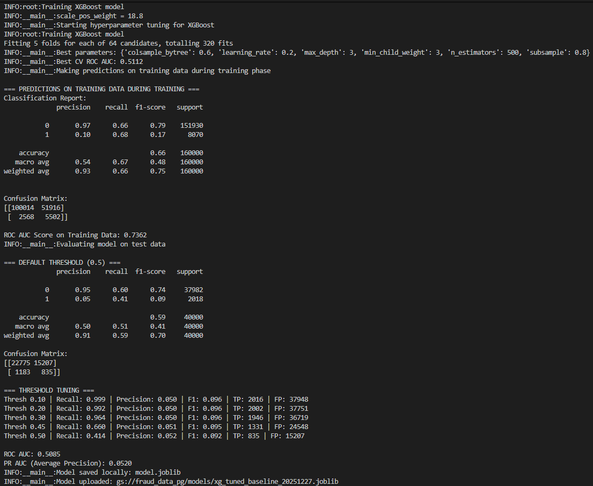

# SMOTE XGBoost Model:


## Model Registry:

**To upload a model to the Model Registry, you can use the gcloud ai models upload command:**
```bash
gcloud ai models upload \ 
    --region=LOCATION \ 
    --display-name=MODEL_NAME \ 
    --container-image-uri=IMAGE_URI \ 
    --artifact-uri=PATH_TO_MODEL_ARTIFACT_DIRECTORY
```

**Create Endpoint to deploy the model:**
```bash
gcloud ai endpoints create \
    --region=LOCATION_ID \
    --display-name=ENDPOINT_NAME
```
**Deploy the model to the endpoint:**
```bash
gcloud ai endpoints deploy-model ENDPOINT_ID`
  --region=LOCATION_ID `
  --model=MODEL_ID `
  --display-name=DEPLOYED_MODEL_NAME `
  --min-replica-count=MIN_REPLICA_COUNT `
  --max-replica-count=MAX_REPLICA_COUNT ` 
  --traffic-split=0=100
```

# Results:

As i have tried with different models and parameters, I found that all the models are giving best ROC_AUC score of 0.5 and it is the fault of the data which i have used. It does not have important features related to fraud detection. That is the reason it is effecting the model performance. 

# References:
https://medium.com/google-cloud/train-inference-with-vertex-ai-in-a-fast-scalable-and-cost-effective-way-d65dd86f45da

https://docs.cloud.google.com/vertex-ai/docs/training/overview

https://www.datascienceverse.com/fine-tuning-xgboost-parameters-a-deep-dive-into-eta-max-depth-and-tree-methods/

https://xgboosting.com/improve-xgboost-model-accuracy-skill/